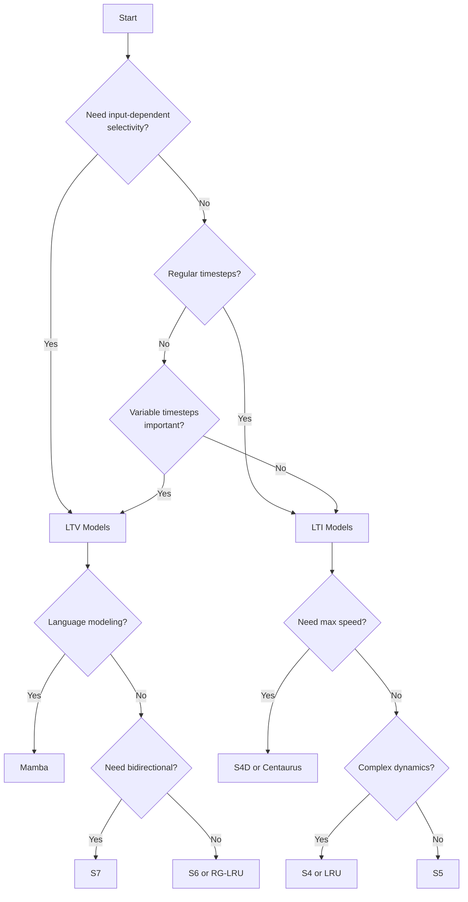

## Overview

Linear RNNs in lrnnx come in two fundamental flavors that differ in how their dynamics evolve over time:

<CardGroup cols={2}>
  <Card title="LTI: Linear Time-Invariant" icon="lock">
    Fixed dynamics - the state transition matrices (A, B, C) are constant across all timesteps
  </Card>

  <Card title="LTV: Linear Time-Varying" icon="wand-magic-sparkles">
    Input-dependent dynamics - the state transition matrices change based on the input at each timestep
  </Card>
</CardGroup>

## Linear Time-Invariant (LTI) models

### How they work

LTI models use **fixed** state-space parameters that don't change during sequence processing:

```python
# LTI: Parameters are constant
h[t] = A_bar @ h[t-1] + B_bar @ x[t]
y[t] = C @ h[t]

# A_bar, B_bar, C are the same for all timesteps
```

Because the dynamics are fixed, LTI models can be computed in two equivalent ways:

<Tabs>
  <Tab title="Recurrent form (inference)">
    ```python
    from lrnnx.models.lti import S4

    model = S4(d_model=64, d_state=64, l_max=1024)
    
    # During inference: process step-by-step
    cache = model.allocate_inference_cache(batch_size=1)
    for t in range(seq_len):
        output, cache = model.step(x[:, t:t+1], cache)
    ```
    **Advantages:** Constant memory, linear time complexity
  </Tab>

  <Tab title="Convolutional form (training)">
    ```python
    from lrnnx.models.lti import S4

    model = S4(d_model=64, d_state=64, l_max=1024)
    
    # During training: process entire sequence in parallel
    x = torch.randn(2, 1024, 64)
    y = model(x)  # Uses FFT-based convolution
    ```
    **Advantages:** Fully parallelized, fast training
  </Tab>
</Tabs>

### LTI models in lrnnx

The library provides several LTI architectures:

| Model | Description | Key Features |
|-------|-------------|-------------|
| **S4** | Structured State Space | DPLR parameterization, excellent long-range modeling |
| **S4D** | Diagonal S4 | Simplified diagonal-only parameterization |
| **S5** | Simplified S5 | MIMO design, processes all channels together |
| **LRU** | Linear Recurrent Unit | Complex-valued diagonal states |
| **Centaurus** | Efficient variants | Multiple architectural patterns (DWS, Neck, etc.) |

<Info>
  All LTI models in lrnnx extend the `LTI_LRNN` base class, which provides the `compute_kernel()` method for FFT-based training.
</Info>

### When to use LTI models

<AccordionGroup>
  <Accordion title="Fixed temporal patterns">
    When your data has consistent dynamics that don't need to adapt based on content. Examples include:
    - Audio waveforms with fixed sampling rates
    - Regular time series (weather, sensor data)
    - Genomic sequences
  </Accordion>

  <Accordion title="Maximum training efficiency">
    LTI models can leverage FFT-based convolutions during training, making them extremely fast to train - comparable to or faster than Transformers on long sequences.
  </Accordion>

  <Accordion title="Proven stability">
    LTI models like S4 have well-understood stability guarantees and initialization schemes that ensure reliable long-range modeling out of the box.
  </Accordion>
</AccordionGroup>

## Linear Time-Varying (LTV) models

### How they work

LTV models compute **input-dependent** parameters at each timestep:

```python
# LTV: Parameters vary based on input
A_bar[t], B_bar[t] = f(x[t])  # Computed from input!
h[t] = A_bar[t] @ h[t-1] + B_bar[t] @ x[t]
y[t] = C @ h[t]

# A_bar[t] and B_bar[t] are different at each timestep
```

This input-dependence is often called **selectivity** - the model can selectively filter or emphasize different information based on the input content.

### Example: Mamba's selective mechanism

```python
from lrnnx.models.ltv import Mamba

model = Mamba(d_model=64, d_state=16, d_conv=4)

# The model adapts its dynamics based on input
x = torch.randn(2, 1024, 64)
y = model(x)  # Internally computes input-dependent A, B, C
```

Inside Mamba, the parameters are computed as:

```python
# Simplified view of Mamba's selectivity
delta = softplus(linear_delta(x))  # Input-dependent timestep
B = linear_B(x)                     # Input-dependent B
C = linear_C(x)                     # Input-dependent C

# A is still fixed, but scaled by input-dependent delta
A_bar = exp(delta * A)
B_bar = delta * B
```

<Note>
  The exact mechanism varies by model. S6/S7 make different matrices input-dependent compared to Mamba.
</Note>

### LTV models in lrnnx

| Model | Description | Selective Mechanism |
|-------|-------------|--------------------|
| **Mamba** | Selective State Space | Input-dependent Δ, B, C (S6 variant) |
| **S6** | Selective S5 | Input-dependent B, C (original) |
| **S7** | Bidirectional S6 | S6 with bidirectional processing |
| **RG-LRU** | Recurrent Gated LRU | Gated variant of LRU |
| **Event-based variants** | Async processing | Support variable timesteps for event data |

<Info>
  All LTV models extend the `LTV_LRNN` base class and support the `integration_timesteps` parameter for event-based processing.
</Info>

### When to use LTV models

<AccordionGroup>
  <Accordion title="Content-dependent processing">
    When the model needs to adapt its behavior based on input content:
    - Language modeling (focus on important tokens)
    - Document understanding (selective information flow)
    - Tasks requiring filtering or gating mechanisms
  </Accordion>

  <Accordion title="Selective copying and recall">
    LTV models excel at tasks that require selectively storing and retrieving information, such as:
    - Selective copying benchmarks
    - In-context learning
    - Association recall tasks
  </Accordion>

  <Accordion title="Event-based data">
    LTV models support asynchronous discretization for irregular time series:
    - Neuromorphic event streams
    - Medical records with irregular timestamps
    - Financial tick data
  </Accordion>
</AccordionGroup>

## Key differences

<Tabs>
  <Tab title="Training">
    | Aspect | LTI | LTV |
    |--------|-----|-----|
    | Parallelization | Full (FFT convolution) | Sequential (scan/recurrence) |
    | Training speed | Very fast | Moderate (optimized with kernels) |
    | GPU utilization | Excellent | Good (with custom kernels) |
  </Tab>

  <Tab title="Inference">
    | Aspect | LTI | LTV |
    |--------|-----|-----|
    | Memory | O(1) - constant state | O(1) - constant state |
    | Compute | O(L) per sequence | O(L) per sequence |
    | Cache requirements | Discretized matrices only | May need conv state (Mamba) |
  </Tab>

  <Tab title="Capabilities">
    | Aspect | LTI | LTV |
    |--------|-----|-----|
    | Expressiveness | Fixed dynamics | Input-dependent dynamics |
    | Selectivity | None | Built-in |
    | Event-based | Limited support | Full support via `integration_timesteps` |
    | Discretization | zoh, bilinear, dirac | zoh, bilinear, dirac, async |
  </Tab>
</Tabs>

## Code comparison

<CodeGroup>
```python LTI Example (S4)
from lrnnx.models.lti import S4

# Create LTI model with ZOH discretization
model = S4(
    d_model=64,
    d_state=64,
    l_max=1024,
    discretization="zoh"
)

# Training: uses FFT convolution internally
x = torch.randn(2, 1024, 64)
y = model(x)

# Inference: step-by-step recurrence
cache = model.allocate_inference_cache(batch_size=1)
for t in range(seq_len):
    output, cache = model.step(x[:, t], cache)
```

```python LTV Example (Mamba)
from lrnnx.models.ltv import Mamba

# Create LTV model
model = Mamba(
    d_model=64,
    d_state=16,
    d_conv=4,
    discretization="zoh"
)

# Training: uses scan (still fast with custom kernels)
x = torch.randn(2, 1024, 64)
y = model(x)

# Inference: step-by-step with input-dependent dynamics
cache = model.allocate_inference_cache(
    batch_size=1,
    max_seqlen=1024
)
for t in range(seq_len):
    output, cache = model.step(x[:, t:t+1], cache)
```

```python Event-based LTV
from lrnnx.models.ltv import Mamba

# LTV models support async discretization
model = Mamba(
    d_model=64,
    d_state=16,
    discretization="async"
)

# Provide timesteps between events
x = torch.randn(2, 1024, 64)
timesteps = torch.randn(2, 1024)  # Variable time deltas

y = model(x, integration_timesteps=timesteps)
```
</CodeGroup>

## Choosing between LTI and LTV

Use this decision tree to guide your choice:



## Next steps

<CardGroup cols={2}>
  <Card title="Discretization" icon="clock" href="/concepts/discretization">
    Learn how discretization methods work and which to use
  </Card>

  <Card title="Model Reference" icon="book" href="/models/overview">
    Detailed API documentation for all models
  </Card>

  <Card title="Linear RNNs" icon="wave-square" href="/concepts/linear-rnns">
    Learn the fundamentals of linear RNNs
  </Card>

  <Card title="Examples" icon="code" href="/tutorials/unet-denoising">
    See complete examples using LTI and LTV models
  </Card>
</CardGroup>
